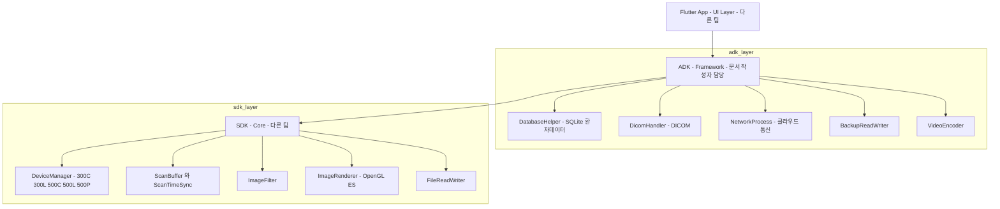

# sonex 라인 아키텍처와 개발 관행

> **근거**: 미러 안의 **힐세리온 자체 작성 문서**(`sonex-app/CLAUDE.md` 4KB · `sonex-framework/CLAUDE.md` 18KB · `docs/` 82개)와 `git` 실측. 힐세리온도 Claude Code 를 쓰므로 이 파일들이 그들의 아키텍처·규약 1차 자료다.
> **표기**: 그들 문서에 적힌 것은 **그들의 서술**이며, 코드로 교차확인한 것만 검증됨으로 표시한다.

## 1. 문서가 있는 저장소는 2건뿐

미러 13건 중 `CLAUDE.md`·`docs/`·`README` 를 가진 것은 `sonex-app`(37개) 과 `sonex-framework`(45개) 뿐이고 **나머지 11건은 셋 다 없다**. [repo-activity.md](repo-activity.md) 의 커밋 활동 편중이 문서에서도 동일하게 나타난다.

## 2. Moana → ADK 마이그레이션은 진행 중인 공식 프로젝트다

`sonex-framework/CLAUDE.md` 에 **「Moana → ADK 마이그레이션 프로젝트」** 절이 통째로 있다. 추정이 아니라 그들이 문서화한 사실이다.

| 그들 문서의 기재 | 경로 |
|---|---|
| Moana (QT) — "기존 QT 기반 앱 (**마이그레이션 소스**)" | `D:\hc_work\project\moana\src\moana` |
| Sonex Framework (ADK) — "**ADK 구현 대상**" | `D:\hc_work\project\sonex\sonex-framework` |

작업 사이클도 명시돼 있다.

> 1. **Moana 시나리오 분석** → 2. 테스트 시나리오 문서화 → 3. C++ 구현 → 4. 테스트 실행·로그 저장 → 5. 성공/실패 판정 → 6. 체크리스트 갱신

`sonex-app/CLAUDE.md` 도 `moana/` 를 **읽기 전용 참조 폴더**로 지정한다("`moana/` … 읽기 전용 참조만 허용"). 즉 **개발자 로컬에는 Moana 소스가 sonex 옆에 놓여 있고, 그것을 보며 재작성한다.**

→ 판단 대기 1번(sonex 전환과의 중복 관계)의 사실관계가 확정된다. **재작성은 이미 진행 중이며 방법론까지 정립돼 있다.**

## 3. 3층 구조와 팀 분리

그들 문서의 아키텍처 그림을 그대로 옮기면 이렇다.



**팀이 최소 셋으로 나뉜다** — Flutter UI 팀 · ADK 팀 · SDK 팀. 그런데 **SDK 와 ADK 가 한 저장소(`sonex-framework`)에 같이 있다.** 저장소 경계와 팀 경계가 어긋나 있으며, 이는 리팩토링 검토에서 다룰 지점이다.

`DeviceManager` 가 **300C·300L·500C·500L·500P** 5개 스캐너 모델의 명령셋을 담는다 — 제품 라인 전체가 이 하나의 SDK 로 수렴한다.

## 4. 기술 스택

| 영역 | 내용 |
|---|---|
| 언어·표준 | C++17, Hungarian notation, `HC` 접두사·네임스페이스 |
| Windows | Visual Studio 2022, Toolset v143, `msbuild`, x64/x86/ARM/ARM64 |
| Android | NDK + CMake, minSdk 28 / targetSdk 34, armeabi-v7a·arm64-v8a·x86·x86_64 |
| iOS/macOS | Xcode workspace, arm64 |
| 렌더링 | OpenGL ES + ANGLE, 셰이더 |
| 서드파티 | OpenCV 4.9.0 · FreeType2 · **Context Vision(CVIE)** · nlohmann/json |
| 산출물 | `SonexFramework.dll` 외 5개 DLL. Flutter 는 FFI/P-Invoke 로 소비 |
| 테스트 하네스 | C# WPF(MVVM) `ADK_Sample_Test` + 플랫폼별 SampleApp |

빌드가 **`.sln`/`.vcxitems`·Gradle·Xcode 3중 체계**다. cctv 의 표준 `Makefile` 단일 진입점과 대비되며, "cctv 유사 형태"의 (iii) 표준 빌드 인터페이스 항목이 여기에 걸린다.

## 5. 개발 관행 — cctv 와 대조

그들 `CLAUDE.md` 의 「Global rules」를 cctv 규약과 나란히 두면 이렇다.

| 항목 | 힐세리온 (sonex-framework) | Beomsoft (cctv) |
|---|---|---|
| 테스트 | **"반드시 테스트를 먼저 작성하고 구현"** (TDD 선작성) | **정반대** — "엄격한 TDD 선작성은 적용하지 않는다. 구현·동작확인 후 테스트 작성" |
| 아키텍처 | **SOLID · Clean Architecture 명시** | feature-first clean architecture |
| 커밋 | "명시적 허락 없이는 절대 commit 금지", `--no-verify` 금지 | "사용자가 명시적으로 요청할 때만" |
| 다이어그램 | **mermaid**(복잡한 것은 svg) | **mermaid** 필수 |
| 문서화 | 컴포넌트별 `/docs/[component].md` | `docs/` SSOT 규약 |
| 언어 | 한국어 문서·주석 | 한국어 문서·주석 |
| mock | "테스트 외 mock 사용 금지" | e2e 대리검증 금지 |

**규약의 방향성은 이미 상당히 겹친다.** 커밋 정책·mermaid·clean architecture·문서화·mock 금지가 사실상 같다. 차이가 큰 곳은 **테스트 시점(TDD 선작성 vs 후작성)** 하나이고, 이건 의료기기 규제(§7)를 고려하면 힐세리온 쪽이 합리적일 수 있다.

→ "cctv 유사 형태로의 리팩토링"에서 **개발 규약 이식은 갈등이 작다.** 실제 간극은 규약이 아니라 **인프라**(CI 부재·빌드 진입점·저장소 경계)에 있다.

## 6. 릴리스·태그 규약은 존재한다

`docs/VERSION_TAGGING.md` 가 규약 문서이며 **Semantic Versioning 2.0.0 준수를 명시**한다. 태그 메시지에 변경사항과 **플랫폼**(공통/Windows/iOS/macOS/Android)을 적는 형식까지 정해져 있다.

실측 태그 (app 14개 / framework 16개):

| 시점 | 태그 | 관찰 |
|---|---|---|
| 2025-10-12 | `v1.0.0-macos` | 플랫폼 접미사 — 규약의 단일 버전 체계에서 이탈 |
| 2026-01-08 | `v0.50.0`~`v0.53.2` **한날 5~6개** | 소급 태깅. 릴리스 시점 기록이 아니다 |
| 2026-02-10 | `adk_v0.51.0` | `v{M}.{m}.{p}` 규약 이탈 |
| 2026-04-28~05-11 | `v3.0.1-Beta` → `v3.0.3` | **0.x 에서 3.x 로 점프** (제품 버전 정렬로 **추정**) |

app 과 framework 가 `v0.53.x`·`v0.54.0`·`v0.56.0`·`v3.0.x-Beta` 를 **맞춰 태깅**한다 → 두 저장소가 함께 릴리스된다.

**cctv 대비**: 규약 문서와 semver 는 있으나 **자동화가 없다**(수동 `git tag -a`). cctv 는 release-please 가 conventional commit 으로 bump·태그·릴리스를 자동 생성한다. 여기에 이식 여지가 있다.

## 7. AI 필터가 SDK 안에 있다 — `research/` 범위 제외는 오판이었다

`sonex-framework/sdk/ai_models/speckle_noise_reduction/` 에 **학습 모델부터 배포 아티팩트까지 전부** 들어 있다.

| 구분 | 파일 |
|---|---|
| 학습 원본 | `pytorch/model_Sobel_Attention_Gate_full2.pth` |
| 변환 스크립트 | `convert_pytorch_to_coreml.py` · `convert_pytorch_to_onnx_opencv.py` |
| 배포 모델 | `onnx/HNS_Denoiser_{DirectML,Embedded,OpenCV}.onnx` · `coreml/UltrasoundDenoiser.mlpackage` |
| 설계 문서 | `hns-filter-implementation.md` · `ai_denoiser_implementation_plan.md` · **`cvie_replacement_plan.md`** |
| 공개 헤더 | `sdk/include/HCSriTable.h` |

**`cvie_replacement_plan.md` 가 목적을 드러낸다** — CVIE(Context Vision Image Enhancement)는 §4 의 상용 서드파티다. 즉 이 AI 필터는 **상용 라이선스 라이브러리를 자체 모델로 대체**하려는 것이다. 태그 이력의 `v0.51.0 iOS Core ML AI 필터`·`v0.54.0 HNS 필터 통합`·`v0.55.0 Windows HNS Filter OpenVINO` 가 그 진행 기록이다.

이는 `NextSRI` 저장소 설명("차세대 SRI 필터 — NLM 필터 대체 버전 / **AI 를 적용한 HNS**")과 정확히 대응한다.

> **정정**: `research/` 5건을 "알고리즘 트랙이라 앱/FW 와 성격이 다르다"며 범위에서 제외한 판단은 **최소한 `NextSRI` 에 대해 틀렸다.** 그 산출물은 이미 제품 SDK 에 통합돼 배포되고 있다. `cf-doppler-neon` 역시 rHFW 통합 예정이라 같은 성격일 가능성이 높다.

**cctv 와의 구조 대비**가 여기서 선명하다. cctv 는 모델 포팅을 `ai/object-detection` **별도 저장소**로 분리한다(호스트 Python 툴체인이 임베디드 빌드와 다르다는 이유). 힐세리온은 **SDK 저장소 안에** 둔다. 같은 문제에 대한 반대 선택이며, "cctv 유사 형태"를 논할 때 실제로 비교 가능한 지점이다.

## 8. 품질 신호 — 커밋된 머지 충돌 마커

`sonex-framework/docs/VERSION_TAGGING.md` 에 **미해결 충돌 마커가 master 에 커밋돼 있다.**

```
<<<<<<< HEAD
- `v0.54.0` - iOS/macOS 500C 지원, HNS 필터 통합 (iOS/macOS)
=======
- `v0.53.3` - 500C 필터 ON/OFF 지원 (Windows)
>>>>>>> d3ce40b (docs: VERSION_TAGGING.md v0.53.4 업데이트)
```

커밋 `9ac1bfd4`, 직전이 `54de47fa Merge branch 'dev/adk_v0.51.0'` 이다. 브랜치 병합 중 충돌을 잘못 해소한 채 커밋됐다.

**전 저장소 13건을 전수 검사한 결과 이 1건뿐이다** — 만연한 문제로 과장하면 안 된다. 다만 코드 리뷰나 CI 검증이 있었다면 걸러졌을 종류이며, [dev-environment.md](dev-environment.md) §3.1 의 **Harbormaster 빌드 기록 0건(CI 부재)** 과 정합한다.

## 9. 브랜치 — 앞선 판단 정정

[dev-environment.md](dev-environment.md) §2.2 에 "브랜치: `master` 단일(검증됨)" 이라 적었으나 **틀렸다.** conduit 의 `defaultBranch: master` 는 *기본* 브랜치를 뜻할 뿐인데 *유일* 로 읽었다. 실제 원격 브랜치:

| 저장소 | 원격 브랜치 |
|---|---|
| `sonex-app` | `master` · `feature-apply_v1.23.3` · `feature-apply_v1.23.4` |
| `sonex-framework` | `master` · `adk_work` · **`dev/adk_v0.51.0`** · `feature-apply_v1.23.3` · `feature-apply_v1.23.4` |

`dev/` · `feature-` 접두사 체계가 있고 `Merge branch 'dev/adk_v0.51.0'` 커밋도 실재한다. **브랜치 전략은 존재한다.** 다만 우리 미러는 `master` 만 체크아웃돼 있어 feature 브랜치 내용은 미조사다.

## 10. 다음 조사

1. `sonex-app/docs/moana-hcm-architecture.md` — **Moana 저장소는 막혀 있으나 아키텍처 문서는 여기 있다**
2. `sonex-app/docs/ADK_migration.md` · `sdk_adk_structure.md` · `windows-sdk-upgrade-proposal.md`
3. `sonex-framework/docs/sdk/` 45개 — 기기별 TODO(300C/300L/500C/500P)·`FIRMWARE_UPGRADE_ANALYSIS.md`·`SDK_FILTER_PIPELINE.md`
4. `SoNex_SDK_개발설계서_230721.pdf` · `SoNex_APP_개발계획서_230821.pdf` — 공식 설계 문서
5. feature 브랜치 내용 (현재 `master` 만 체크아웃)
