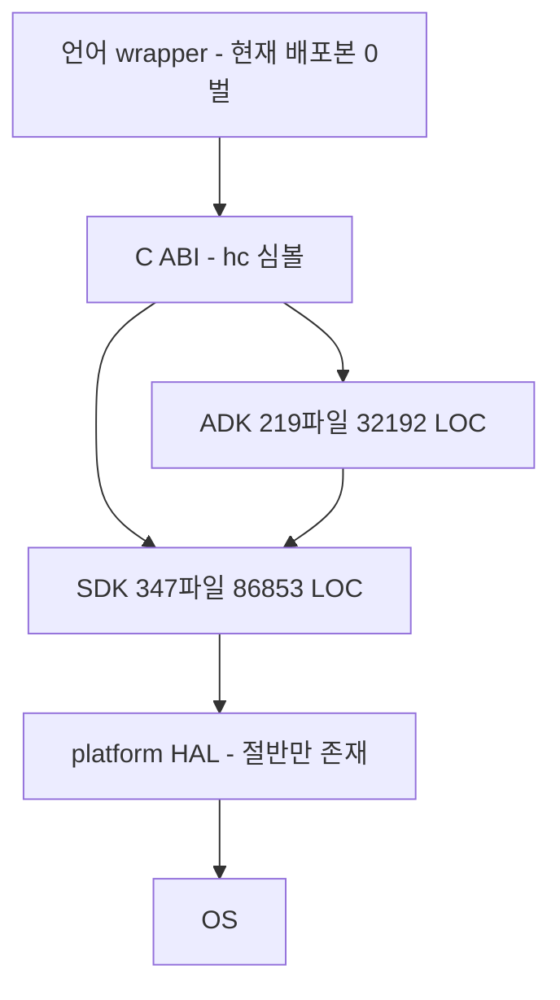

# `sonex-framework` 실측 — SDK·ADK 코드베이스

> **왜 이 문서가 있는가**: 리팩토링 수정 대상이 **`sonex-framework` 로 확정**됐다([../refactoring/plan.md](../refactoring/plan.md)). 고칠 코드의 실측이 한곳에 있어야 한다.
> **근거**: `client/legacy/sonex-framework` `master` `f336e25b`(2026-07-23) 코드 직접 확인(2026-07-27 ~ 07-29).
> **브랜치 구도(2026-07-30 실측)**: 로컬 HEAD == `origin/master` == `f336e25b`(마지막 fetch 2026-07-27). **이 저장소는 master 가 주 개발선이다** — 루트 `CLAUDE.md` 의 조직 통칙("master 에서 작업하지 않는다")은 `belle-fw`·`moana` 에는 맞지만 여기는 예외다. master(2026-07-23)가 최신 tip 이고, `dev/adk_v0.51.0`·`adk_work` 는 **master 에 완전 병합**돼 고유 커밋 0 이다(master 가 각 167·363 앞섬). master 밖은 `feature-apply_v1.23.4` 의 **2커밋뿐**(SRI 필터 `HCSRIv23_3`·`HCSRIv23_4` SDK 통합). **따라서 master 스냅샷이 곧 현행이다.**
> **관계**: 앱 쪽은 [sonex-app.md](sonex-app.md) · 렌더링 상세는 [legacy/sonex-rendering.md](legacy/sonex-rendering.md) · 그들 문서의 주장은 [sonex-architecture.md](sonex-architecture.md) · 2023 설계 대조는 [SoNex-Requirement/summary.md](SoNex-Requirement/summary.md).

## 1. 저장소 구성 — 2.0GB 중 자체 소스는 0.3%

| 버킷 | 크기 | 비중 | 내용 |
|---|---:|---:|---|
| 벤더 프리빌트 `sdk/adk/library/` | **1,128MB** | 55% | OpenCV 3.4.5/3.4.6 · DCMTK 3.6.5 · FFmpeg 4.0.2/4.1.4 · cpr · curl · openssl · minizip · wxsqlite3 |
| `.git` 오브젝트 DB | 525MB | 26% | 위 바이너리들의 전 버전 |
| 샘플 앱 안에 중복된 바이너리 | ~144MB | 7% | |
| 상용 `third_party/context_vision/` | 82MB | 4% | §8.2 |
| **커밋된 빌드 캐시** `sdk/sdk/Main/macos/build/` | 27MB | 1.3% | `.o`·`CMakeCache.txt` **194파일 추적 중** |
| AI 모델 가중치 | 14MB | 0.7% | §8.3 |
| **자체 소스 전체** | **~7MB** | **0.3%** | **~240,900 LOC** |

**`.gitignore` 가 무효다** — `/sdk/adk/library/` 규칙이 파일이 이미 추적된 뒤 추가돼 소급되지 않는다. `git ls-files sdk/adk/library` = 2,600 파일 = 디스크 전량.

## 2. 계층 구조



| 계층 | 모듈 | LOC |
|---|---|---:|
| **SDK** (`sdk/sdk/`, 347파일, **86,853**) | `ImageRenderer` (§4) | **38,501** |
| | `DeviceManager` (§5) | 17,022 |
| | `ImageFilter` | 14,821 |
| | `Main`(`HCSonexSDK`) | 9,274 |
| | `FileReadWriter` | 4,870 |
| | `ScanBuffer` / `ScanTimeSync` | 1,575 / 790 |
| **ADK** (`sdk/adk/`, 219파일, **32,192**) | `Main`(`HCSonexADK`·`HCSonexFramework`) | 16,655 |
| | `BackupReadWriter` | 5,054 |
| | `DatabaseHelper` | 4,151 |
| | `DicomHandler` | 2,732 |
| | `VideoEncoder` | 2,279 |
| | `NetworkProcess` | 1,321 |
| 공유 | `common/` (69파일) / `include/` (공개 API 120파일) | 8,364 / 14,470 |

**Dart 파일 0개** — 순수 네이티브 SDK/ADK 다.

### 2.1 의존 방향 — 코드는 지켜지고 빌드에서 깨진다

| 방향 | 수준 | 실측 |
|---|---|---|
| ADK → SDK (정상) | 코드 | **7파일**이 SDK 참조 |
| **SDK → ADK (금지)** | 코드 | **0건** |
| **SDK → ADK (금지)** | **빌드** | **iOS CMakeLists 10건** — `../adk/library/{angle,freetype,opencv,openssl}_ios/…` |

**iOS 국소 이탈이다.** macOS CMakeLists 는 중립 위치(`../third_party/angle_macos/`)를 쓰며, 이동 주석이 *"Phase 2-C C-2: third_party 경로 → sdk/adk/library/ 우리 환경 일치"* 로 **로컬 환경 편의**임을 밝힌다.

### 2.2 platform HAL 이 절반만 있다

| 대상 | 상태 |
|---|---|
| 소켓 | ✓ `HCCompSocket{Windows,Android,IOS}` 3벌 |
| 오디오 출력 | ✓ `HCAudioPlayer_{Windows,Android,iOS}` 3벌 |
| AI 필터 | Apple 만 (`HNSFilter{,V2}_{iOS,macOS}.mm`) |
| **렌더 서피스** | **없음** — `HCiOSGLContext.mm` 하나뿐이고 **빌드 제외** |
| **이벤트 입력** | **없음** — `hc_DispatchTouchEvent` 로 앱이 좌표를 밀어넣는다 |

**HAL 이 없는 둘이 렌더링과 이벤트다.** 그래서 `HCImageRenderCore.cpp`(shared)가 `#if OS_*` 로 직접 `eglCreateWindowSurface(nativeWindow)` 를 부르고 **윈도우 핸들이 공개 API 로 새어 나온다.** 판단·해소안 = [../refactoring/rendering-boundary.md](../refactoring/rendering-boundary.md).

### 2.3 플랫폼 분기와 Linux

플랫폼 디렉토리 분포 — `android` 14 · `ios` 11 · `windows` 14 · `macos` 2 · `shared` 14 · **`linux` 0**.

`HCCommon.h` 의 분기가 Windows / Android / Apple 3갈래이고 **`#else` 절이 없다.**

```c
#if   defined(_WIN32) || defined(_WIN64) || (PLATFORM == 3)      // Windows
#elif defined(__ANDROID__) || (PLATFORM == 1)                    // Android
#elif defined(__APPLE__) || defined(__MACH__) || (PLATFORM == 2)  // Apple
#endif   // else 없음. #error 도 없음
```

Linux 에서는 `OS_WINDOWS`·`OS_ANDROID`·`OS_IOS` 가 **전부 미정의**가 되고, 전처리기가 0 으로 평가해 **에러 없이 모든 분기가 조용히 거짓**이 된다. **방어용 `#error` 조차 없다.**

> macOS 는 전용 갈래 없이 `__APPLE__` 로 잡혀 **`OS_IOS true`** 가 된다. 렌더러는 `#elif OS_IOS || OS_MACOS` 로 쓰는데 `OS_MACOS` 는 이 헤더에 정의가 없어 0 으로 평가되고, macOS 가 iOS 분기를 탄다.

## 3. 공개 계약

### 3.1 공개 헤더가 구현 헤더의 절반이다

`HCSonexSDKInterface.h` 가 **두 벌** 있다.

| | 경로 | 줄 | `hc_*` | 최종 수정 |
|---|---|---:|---:|---|
| **공개** | `sdk/include/` | 341 | **27** | 2026-05-27 |
| **구현** | `sdk/sdk/Main/shared/` | 672 | **54** | 2026-06-01 |

**고객사가 받는 공개 헤더에 실제 API 의 절반만 있다.**

**그리고 그 헤더의 절반 이상이 `#include` 조차 되지 않는다** `[실측 2026-07-30]` — `sdk/include/*.h` **62개를 각각 단독 컴파일**(`g++ -fsyntax-only -std=c++17 -I sdk/include`)하면 **36개가 실패**한다.

| 원인 | 건수 | 성격 |
|---|---:|---|
| **표준 헤더 include 누락** | **28** | **순수 코드 결함** — 예: `HCScannerModelSpec.h:15` 가 `std::list` 를 쓰는데 `<list>` 미포함 |
| 외부 의존 헤더 부재 | 8 | freetype(`ft2build.h`)·opencv·EGL 등. §7.2 의 의존물 확보 문제와 같은 계열 |

**계약의 본체인 `HCSonexSDKInterface.h` 도 실패한다**(전이적으로 `HCFontLoader.h` → `ft2build.h`). umbrella 헤더가 없고 `HCCommon.h` 를 먼저 넣어도 해소되지 않는다.

> **28건은 ANGLE·freetype 확보와 무관하게 지금 고칠 수 있다** — 의존물 문제와 코드 결함을 섞어 보면 "빌드 환경만 갖추면 된다"로 오판하게 된다.

**ADK 는 공개 헤더 개념 자체가 없다** — `sdk/include/` 에 ADK 헤더가 **0건**이고, `sdk/adk/Main/shared/HCSonexADKInterface.h`(25 심볼)만 존재한다.

### 3.2 파사드가 제네릭 디스패처다

`hc_SendRequest(int requestCode, const wchar_t* jsonParam)` → `SonexSDK::unifiedRequest(requestCode, jsonParam)` → `REQUEST_*` 매크로 `switch`. 같은 패턴이 ADK 에도 있다 — `NetworkProcess::sendRequest(int commandCode, const std::map<std::string,std::string>&)`.

요청 코드와 JSON 스키마가 **헤더에 없어** 컴파일러가 오용을 잡지 못한다.

### 3.3 동명 심볼 충돌

| 심볼 | SDK | ADK |
|---|---|---|
| **`HC::DeviceManager`** | `sdk/sdk/DeviceManager/shared/` — **물리 스캐너**(소켓·명령) | `sdk/adk/Main/shared/managers/` — **클라우드 등록 자산**(`registerDevice`·`getDeviceList`) |
| **`HC::ResultCode`** | `HCCommon.h` — 약 50개 값 | `adk/Main/ios/HCSonexSDK_iOS.h` — **6개 값, 같은 숫자에 다른 뜻** |

`ResultCode` 가 특히 위험하다 — 값 1 이 SDK 에서는 `PROGRESSING`(정상 진행)인데 ADK iOS 헤더로는 `NOT_CONNECTED`(연결 실패)다. `StreamMode` 도 함께 재정의된다.

### 3.4 C++ 타입이 C ABI 로 샌다

```c
extern "C" ExportSDK HC::StreamData* hc_GetLatestRawFrame(int streamIndex);
```

`extern "C"` 인데 **C++ 클래스 포인터를 반환**한다. C#·Java·Python 에서 안정적으로 소비할 수 없다.

`[실측 2026-07-30]` **단발 사례가 아니라 28건**이다(`sdk/include/*.h` + `sdk/sdk/Main/shared/*.h`). `hc_create*Instance` 계열 6모듈이 전부 `HC::클래스*` 를 반환한다.

### 3.5 앱이 부르는 심볼의 27%가 프레임워크에 없다

`[실측 2026-07-30]` `sonex-app` 의 `lib/services/` 가 참조하는 `hc_*` 고유 심볼 **108개 중 29개**가 `sonex-framework` 에 정의가 **0건**이다(`master`·`feature-apply_v1.23.4` 양쪽 확인, `.cpp`·`.h`·`.mm`·`.cs`·`.java` 전수).

**렌더·재생 경로가 대량 포함된다** — `hc_GetLatestFrameByType` · `hc_GetDisplayedFrameByType` · `hc_SetPlaybackScanMode` · `hc_PushPlaybackCineFrame` · `hc_RedrawPlaybackB` · `hc_ReadLastFramebufferBgra` · `hc_GrabFrontBufferBgraNow` · `hc_RequestCaptureNextFrame` · `hc_GetMeasureObjectsData` · `hc_GetCineMeasureObjectsData` · `hc_SetSideRulerVisible` 등.

**손으로 쓴 FFI 바인딩이라 컴파일러가 잡지 못하고**, 앱은 `print("[실패] … 함수를 찾을 수 없음")` 방어 코드로 덮는다(`NativeMethods.dart:731,849,870` 등).

> **판정 주의**: 앱이 심볼을 **선언**했다는 것과 SDK 가 그것을 **제공**한다는 것은 다른 차원의 사실이다. 이전 판이 앱 선언을 SDK 기능으로 읽어 "픽셀 반출 API 가 이미 셋 있다"고 적었던 것이 그 혼동의 사례다(§4.2 정정).

### 3.6 `HCCommon.h` 가 갈라져 있고 `OS_MACOS` 가 한쪽에만 있다

`[실측 2026-07-30]` `HCCommon.h` 가 **4벌**이고 내용이 둘로 갈린다.

| 경로 | md5 | `OS_MACOS` 정의 |
|---|---|---|
| `sdk/include/HCCommon.h` | `7b04c5df` | **있음**(3회) |
| `sdk/common/shared/HCCommon.h` | `a4f66d89` | **없음** |
| `sdk/sdk/sample/SDK_Sample_Android/app/include/HCCommon.h` | `a4f66d89` | 없음 |
| `sdk/adk/sample/Android_SampleApp/app/include/HCCommon.h` | `25382d17` | 없음(분기 자체가 0) |

그런데 **`OS_MACOS` 를 쓰는 파일이 12개**다(`HCImageRenderCore.cpp:782` 포함). **어느 사본이 include 되느냐로 macOS 분기가 살고 죽는다** — 전처리기는 미정의 식별자를 0 으로 평가하므로 조용히 거짓이 된다(§2.3 의 `#else` 부재와 같은 계열의 결함).

## 4. 렌더링

### 4.1 ANGLE 백엔드 폴백

`HCImageRenderCore.cpp:775-793`

| 플랫폼 | 우선순위 |
|---|---|
| Windows | D3D11 → D3D9 → Vulkan → OpenGL |
| **iOS / macOS** | **Metal** → Vulkan → OpenGL |
| Android | Vulkan → OpenGL |

**Apple 의 OpenGL ES deprecation 을 Metal 백엔드로 회피하고 있다.** EAGL 을 직접 쓰는 `HCiOSGLContext.mm` 은 CMakeLists 에서 **주석 처리돼 빌드되지 않는다** — *"HCiOSGLContext는 ANGLE 사용 시 불필요"*.

### 4.2 오프스크린 경로

| 항목 | 상태 |
|---|---|
| **FBO 오프스크린 렌더** | **이미 구현. 단 헤드리스가 아니다** — `glGenFramebuffers(&g_cineFbo)`(`HCImageRenderCore.cpp:78-348, 2700-2716`, cine snapshot 용). **기존 GL 컨텍스트를 전제**하고 `prevFbo` 를 백업·복원한다 |
| **PBuffer 서피스** | **구현된 적 없다** — EGL config 블록(`:900-912`) **전체가 주석**이고 `EGL_PBUFFER_BIT` 는 그 안의 재주석이다. 활성 config(`:914-920`)엔 `EGL_SURFACE_TYPE` 자체가 없다. **SDK 에 `eglCreatePbufferSurface` 호출 0건**(iOS 샘플 `AngleProbe.mm:56` 만 예외) |
| **완성 프레임 반환 — 실동작 경로가 있다** | `hc_GetBufferRenderedFrameAt`(`HCSonexSDKInterface.cpp:430-471`, **플랫폼 가드 없음**) → `renderCineFrame` → `hc_renderCineFrameFromGray` → `cine::submitCineJobExternal` → `processOneCineJobGL`(`:2650`) → cine FBO → `glReadPixels`. **앱이 실제로 호출**(`NativeMethods.dart:1603`). 한계 셋 = B모드만·GL 컨텍스트 전제·인덱스 입력 고정. **공개 헤더에는 없다**(구현 전용 27개 중 하나) |
| 픽셀 반출 API | `hc_ReadRenderedImage` 는 **iOS 전용** — C ABI(`HCSonexSDKInterface.cpp:331`)·파사드(`HCSonexSDK.cpp:483`)가 `#if OS_IOS`, 코어(`HCImageRenderCore.cpp:2787`)만 `#if OS_IOS \|\| OS_MACOS`. **가드 불일치로 macOS 는 구현이 빌드되나 호출자가 없다.** 그런데 **공개 헤더 `sdk/include/HCSonexSDKInterface.h:263` 은 무조건 선언**한다. 구현은 FBO 바인드 없는 `glReadPixels` 라 주석 *"ANGLE renders to off-screen pbuffer"* 는 **존재하지 않는 메커니즘**을 적은 것이다. `hc_ReadLastFramebufferBgra`·`hc_RequestCaptureNextFrame`·`hc_GrabFrontBufferBgraNow` 는 **앱 Dart 선언에만 있고 프레임워크 0건**(§3.5) |
| 측정 기하 반출 | **없다** — `hc_GetMeasureObjectsData` 는 앱 선언만, `hc_GetRenderObjects` 는 **앱에도 프레임워크에도 없다**(§3.5) |
| **공유 텍스처** | **미구현** — `EGLImage`·`IOSurface`·`AHardwareBuffer` 사용처 **0건**(glad 가 함수 포인터만 로드) |
| 메인 경로 | `eglCreateWindowSurface(..., (EGLNativeWindowType) nativeWindow, ...)` — 윈도우 고정 |

### 4.3 그리는 대상

| 분류 | 객체 |
|---|---|
| 스캔 이미지 | `HCScanBConvex`·`HCScanBLinear`·`HCScanCFConvex`·`HCScanCFLinear`·`HCScanSpectrum`·`HCScanMCursor`·`HCScanPwCursor` |
| 눈금 | `HCScanSideRuler` — `depthText`·`topCmText`·`graduationTexts` |
| 측정 (7종) | `HCMeasureDistance`·`Length`·`Angle`·`Ellipse`·`Time`·`BVF`·`Depth` 등의 `resultText`·`angleText`·`volumeText` |
| 도형 primitive | `HCRenderShapeBorder`·`Dash`·`Ellipse`·`Image`·`Line`·`Text`·`HCRenderTouchPoint` |
| 셰이더 (7종) | `HCColorDopplerShader`·`HCGrayscaleShader`·`HCPowerDopplerShader`·`HCShapeShader` 등 |
| 폰트 | `HCFontLoader` + freetype. `hc_SetFontFilePath`·`hc_SetFontRawData` |
| 입력 | **`HCTouchRecognizer`** — drag·double-click 판정까지 SDK 소유 |

**MI/TI(음향출력)는 SDK 렌더러에 0건**이다 — `ScannerModelSpec` 에 `acusticOutputMi`·`acusticOutputTib`(주석 *"인증 요구 사항"*)가 데이터로만 있고, 표시는 앱이 한다.

## 5. 장치 통신

`sdk/sdk/DeviceManager/shared/` 가 프로토콜 스택 전부다.

| 계층 | 파일 |
|---|---|
| 패킷 | `HCPacketData` — `HC_PACKET_HEADER_SIZE = 14` · `0x48`(`'H'`) · `0x43`(`'C'`) |
| 소켓 | `HCSocketCommunicator` · `HCCompatibleSocket` + 플랫폼 3벌 · `HCSocketEvent` |
| 스레드 | `HCTxWorker` · `HCRxWorker` |
| 모델별 명령셋 | `HCInstructionSet` + **300C·300L·500C·500L·500P·Default 6종** |

전송은 **WiFi TCP 뿐**이다(USB·BLE 코드 없음). 장비가 자체 AP 이고 고정 IP `192.168.10.1`, 논리 채널 2개(`CONTROL`/`DATA`), `SOCKET_BUFFER_SIZE = 1MB`.

**CVIE 라이선스가 장비에서 온다** — `HCInstructionSet500L.cpp:393` 이 장비 정보 패킷 필드 31 에서 키를 읽고, `HCLiveController.cpp:3079` 가 `cvieValidation(serial, key)` 로 시리얼과 짝지어 검증한다. `500L`·`500P`·`500C` 만 읽는다.

## 6. ADK

### 6.1 모듈과 엔드포인트

`HCNetworkProcess.cpp:17` `base_url = "http://sonex.healcerion.com:8080/API/"` — **평문 HTTP**. 엔드포인트 **19개**.

| 묶음 | 엔드포인트 |
|---|---|
| 계정(SSO) | `SignUp` · `LogIn` · `GetProfile` · `ChangeProfile` · `ResendAuthMail` · `ForgotPassword` · `CheckDuplicateID` · `Withdrawal` · `MigrationUser` · `ChangePassword` |
| 장비(SDI) | `GetDeviceModelList` · `GetDeviceList` · `RegistDevice` · `UpdateDevice` · `GetBatteryList` · `RegistBattery` · `UpdateBattery` |
| 로그(ELA) | `AddEventLog` |
| 기타 | `HEAL` |

[cloud-server.md](cloud-server.md) 의 `sonex-cloud-backend` 모듈 구성(SSO·SDI·ELA)과 대응한다.

### 6.2 ADK 가 장비를 직접 만지는 두 곳

| 경로 | 내용 |
|---|---|
| **FTP** (전 플랫폼) | `FTP_SERVER_IP = "192.168.10.1"` · `FTP_USER = "root"` — **장비 내장 FTP 서버에 직접 접속**(`HCFirmwareController.cpp:24-27`). 주석: *"Moana FTP 접속 상수"* |
| **iOS raw socket** | `adk/Main/ios/HCSonexSDK_iOS.cpp` 에 `connectToDevice(ip, controlPort, dataPort)` **중복 구현**. control·data 2소켓 구조까지 SDK 와 동일. `SonexFramework.iOS.xcodeproj` 에 등록돼 있고 `#include "HCSonexSDK_iOS.cpp"` 로 소스 인클루드 |

그 외에는 **ADK 에 `HC_PACKET_HEADER`·`SocketCommunicator`·`InstructionSet` 이 0건**이며 장비 명령은 SDK 를 거친다.

### 6.3 펌웨어 업그레이드 — 계열마다 경계가 다르다

| 구성 | 위치 |
|---|---|
| SN 명령 전송(base64 디코딩 → 소켓) | **SDK** `HCLiveController` |
| SN 순서 상태머신(B3→MSP · 청크 위치 · 진행률 · stop-and-wait · **768B**) | **ADK** `FirmwareController` (555줄 중 `sn*` 40군데) |
| 버전 판정 · FTP 오케스트레이션 | **ADK** |

주석이 출처를 밝힌다 — *"Moana FirmwareUpdater 미러"*.

| 계열 | SDK 만으로 업그레이드 |
|---|---|
| **500L** | **불가** — 아래 정정 |
| **500C/500P** | **불가** — 순서·청크·단계 지식이 ADK 에만 있다 |

> **정정(2026-07-30 실측)**: 이전 판이 *"500L 은 `startFirmwareUpdate(filePath)` 단일 호출로 가능"* 이라 적었으나 **틀렸다.** 그 SDK 진입점의 실제 본문은 **껍데기**다.
>
> ```cpp
> // HCSocketCommunicator.cpp:643
> ResultCode SocketCommunicator::startFirmwareUpdate(std::wstring filePath) {
>     return SUCCESS; // TODO
> }
> ```
>
> `DeviceManager::startFirmwareUpdate`(`HCDeviceManager.cpp:146`)는 이것으로 위임할 뿐이고 `cancelFirmwareUpdate` 도 같다. **따라서 비대칭이 아니라 전 계열이 ADK 경유**이며, 이 함수는 공개 헤더(`sdk/include/HCDeviceManager.h:85`·`HCSocketCommunicator.h:58`)에 **성공을 반환하는 API 로 노출돼 있다** — 고객사가 호출하면 조용히 `SUCCESS` 를 받고 아무 일도 일어나지 않는다.

## 7. 빌드

### 7.1 플랫폼마다 다르다

`CMakeLists.txt` 가 **4개뿐**(신규 macOS/iOS SDK + Android 샘플 2개)이고 나머지는 MSBuild·Xcode·`ndk-build` 다.

| 타깃 | 빌드 | 산출물 |
|---|---|---|
| Windows | `sdk.sln`·`framework.sln`, **`.vcxproj` 29개**. `Debug/Release × Win32·x64·ARM·ARM64` | `.dll` + 모듈별 `.lib` |
| Android | `build_all_android.sh` → `ndk-build`, `Android.mk` 를 셸이 인라인 생성. `APP_ABI=arm64-v8a` 단일 | `.so` |
| macOS/iOS | CMake. `add_library(SonexSDK SHARED)` + `FRAMEWORK TRUE` | `.framework` |

### 7.2 깨끗한 체크아웃에서 컴파일되지 않는다

**`EGL_PLATFORM_ANGLE_ANGLE` 등 ANGLE 확장 상수가 저장소 어디에도 정의돼 있지 않다.** 전수 검색 결과 유일한 등장처가 소비처인 `HCImageRenderCore.cpp` 이고, 번들된 `glad_egl.h`(83KB)에도 `EGL_PLATFORM_ANGLE*` 는 0건이다.

→ **`ImageRenderer` 가 전 플랫폼에서 링크가 아니라 컴파일 단계에서 실패한다.**

**ANGLE 경로가 세 곳에 서로 다르게 선언돼 있고 전부 부재하다.**

| 선언 위치 | 경로 | 디스크 |
|---|---|---|
| `third_party/readme.txt` | `third_party/angle/out/{android_v7a,v8a,x64,ios_arm64,ios_x64,windows_x64}` | **부재** |
| iOS CMakeLists | `sdk/adk/library/angle_ios/libEGL.xcframework/…` | **부재** (git 추적 0건) |
| macOS CMakeLists | `sdk/third_party/angle_macos/…` + `third_party/angle/include` | **부재** |

Windows·Android 빌드 스크립트에는 **ANGLE 참조가 0건**인데 런타임은 D3D11 ANGLE 을 호출한다.

### 7.3 플랫폼별 의존성 결손

| 플랫폼 | 있는 것 | **없는 것** |
|---|---|---|
| Android | opencv · openssl · dcmtk · ffmpeg · cpr · curl | **angle · freetype** |
| iOS | openssl · minizip | **angle_ios · freetype_ios · opencv_3.4.6_ios** |
| macOS | — | **angle_macos · angle/include** (+ Homebrew 절대경로 `/opt/homebrew/Cellar/opencv/4.12.0_11/`) |
| Windows | opencv_msvc64 · ffmpeg_msvc64 | ANGLE DLL 출처가 빌드 시스템에 없음 |

**Android 가 가장 가깝다.** 커밋된 빌드 캐시에는 `/Users/rio/work/sonex-framework/…` 경로가 박혀 있다.

> 힐세리온 머신에서는 빌드된다 — 최신 커밋이 *"500C/P WiFi(RS9116) 펌웨어 통합 굽기 — 5계층 구현 + **실장비 검증**"* 이다. **저장소만으로 안 될 뿐이다.**

## 8. 서드파티

### 8.1 목록

`sdk/adk/library/` 13개 — cpr 1.12.0 · curl 8.13.0 · dcmtk 3.6.5 · ffmpeg 4.0.2/4.1.4 · minizip 2.8.4 · opencv 3.4.5/3.4.6 · openssl 1.1.1d · stb · wxsqlite3.
`sdk/third_party/` 3개 — `context_vision` · `nlohmann_json` · `readme.txt`.

**서드파티 고지 0건.**

### 8.1b `wxsqlite3` — 환자 DB 암호화 계층

`[실측 2026-07-30]` `sdk/adk/library/wxsqlite3/` 는 단순 벤더 사본이 아니라 **암호화 엔진 전체**다.

| 항목 | 값 |
|---|---|
| 정체 | **wxSQLite3 v4.0.4 (sqlite3secure)** — `HCDatabaseCrypto.h` 주석에 명시 |
| 임베드 SQLite | **3.24.0**(2018-06) |
| 지원 암호 | `CODEC_TYPE_{AES128, AES256, CHACHA20, SQLCIPHER}` 4종(`codec.h:37-42`), 기본값 CHACHA20 |
| **실제 사용 암호** | **`PRAGMA cipher = 'aes256cbc'`**(`HCDatabaseCrypto.cpp:103`) — 기본값이 아니라 명시 선택 |
| 키 도출 | **PBKDF2-SHA1, 10000회, 128** → Base64 → `left(32)` → hex → `PRAGMA hexkey` |
| 호환 기준 | **"Moana 호환"** — 기존 출하 DB 를 열어야 한다 |
| 구성 파일 | `codec.c`(67KB) · `rijndael.c`(102KB) · `chacha20poly1305.c` · `fastpbkdf2.c` · `sha1/sha2/md5` · `rekeyvacuum.c` + `sqlite3.c`(7.4MB) |

**보안 결함 셋이 함께 있다.**

| # | 실측 | 영향 |
|---|---|---|
| **①** | **Windows 는 암호화하지 않는다** — 호출부가 `#if OS_ANDROID \|\| OS_IOS` 안에 있고(`HCDataBaseAdapter.cpp:170`), 헤더 주석도 *"Android/iOS 전용 (Windows는 비암호화)"* 라고 적는다. `#if` 분기 제외에 그치지 않고 **빌드 자체가 다른 SQLite 를 링크**한다 — `DatabaseHelper/windows/windows.vcxproj:143,149-150`가 `adk/library/sqlite3`(코덱 없는 프리빌트 `sqlite3.lib`)를 참조하며 `wxsqlite3`는 이 프로젝트에 전혀 등장하지 않는다. 반면 `android.vcxproj:280`·iOS `project.pbxproj:38`는 `sqlite3secure.c`를 직접 컴파일해 넣는다 — 코덱 자체가 Windows 빌드에 없으므로 조건만 바꿔서 켤 수도 없다 | **환자 DB 가 Windows 에서 평문**이다 |
| **②** | **암호화 실패 시 비암호화로 폴백한다** — `"Encryption failed, trying as unencrypted DB..."`(`HCDataBaseAdapter.cpp:173-186`) | **fail-open**. 키가 틀려도 조용히 진행 |
| **③** `[2026-07-30 추가 실측]` | **'Moana 호환' 레거시 재시도가 죽은 코드다** — `DatabaseCrypto::applyEncryption()`(`HCDatabaseCrypto.cpp`)이 1차 시도(`PRAGMA cipher='aes256cbc'` 103행 + `PRAGMA hexkey=...` 118-119행)로 `SELECT count(*) FROM sqlite_master` 검증(127행)에 실패하면, `PRAGMA legacy=1`·`PRAGMA kdf_iter=64000`(138·145행)만 설정하고 **`hexkey`를 다시 호출하지 않은 채** 153행에서 재검증한다. 벤더 코덱(`codec.c`)을 직접 대조한 결과 `cipher`/`legacy`/`kdf_iter` PRAGMA는 커넥션별 설정값(`CipherParams.m_value`)만 갱신할 뿐이고, 실제 코덱 부착·키 적용은 `key`/`hexkey` 호출 시점에만 일어난다 — 즉 153행의 재검증은 127행과 **동일한 키·동일한 실패로 귀결되는 무의미한 재시도**다. `legacy` 모드로 실제 재시도하려면 config 변경 뒤 `hexkey`를 다시 호출해야 하는데 그 호출이 없다. Moana 원본(`moana` `origin/service_QT693:framework/Database/SononDataBaseAdapter.cpp`)은 이 재시도 로직 자체가 없고 Qt 플러그인(`QWXSQLITE3`)의 `setPassword()`를 쓰는 별개 경로라, 이 결함은 이식 과정의 누락이 아니라 **sonex-framework 자체 구현에서 새로 발생**했다 | 기존 Moana 출하 DB(레거시 페이지 레이아웃일 가능성) 임포트 시 이 경로를 타면 **항상 실패**하고 ②의 fail-open 폴백으로 떨어진다. 신규 설치(빈 DB)는 1차 시도만으로 통과하므로 이 결함은 **마이그레이션·임포트 시나리오에서만 드러난다** — "붙는 것 같은데 실제로는 안 되는" 증상과 부합 |

> **이것은 의존물 조달 문제가 아니라 보안·규제 문제다.** 의료 데이터를 다루므로 [goal.md B4](../refactoring/goal.md) 와 별개로 판단이 필요하다. 대안 검토 = [refactoring/r1/phase0](../refactoring/r1/phase0-build-reproducibility.md) Step 0-C-W.
>
> **미확인**: ③이 실행 시점에 실제로 어느 분기로 떨어지는지(폴백이 "평문으로 계속 진행"인지 "DB 오픈 자체 실패"인지)는 SQLite 커넥션이 1차 키 적용 실패 후 스키마 캐시를 어떤 상태로 유지하는지에 달려 있어 정적 코드 분석만으로 단정할 수 없다 — 실행 재현이 필요하다.

### 8.2 CVIE (ContextVision, 상용)

| 항목 | 실측 |
|---|---|
| 바이너리 | `libcvie64.so`(android) · `cvie64.framework`(ios) · `cvie64.dll`(windows), 82MB |
| **기밀 표기** | `READMESDK.txt`·`README_CVIESDK.txt` 첫 줄 **`CONTEXTVISION COMPANY CONFIDENTIAL`**(Copyright 2011-2022 ContextVision AB) |
| **라이선스 파일 커밋** | `third_party/context_vision/license_key/ID-0001200-001.cov`(4,490 B) |
| 계약서 | **저장소에 없음** — `COPYRIGHT.txt` 는 CVIE 가 포함한 서브컴포넌트(Khronos·NVIDIA 등) 고지다 |
| 적용 범위 | **500 시리즈만** · **macOS 미지원**(`#if !OS_MACOS`) |
| 동작 조건 | `cvLicensePassed && support && enable && settingIndex > -1` |

`HCImageFilter.cpp` 의 `#else` 주석이 *"CVIE: Windows only"* 인데 조건은 `!OS_MACOS`(Windows·Android·iOS)다 — 주석이 낡았다.

### 8.3 AI 필터 (CVIE 대체 트랙)

`sdk/ai_models/speckle_noise_reduction/` 14MB — `.pth`(학습 원본) · `.onnx` 3종 · CoreML `.mlpackage`. **학습 코드는 없고** 변환 스크립트만 있다.

| 플랫폼 | 상태 |
|---|---|
| macOS·iOS | **실동작** — `HNSFilterV2_macOS.mm` 이 CoreML 로 추론 |
| Windows | **미구현** — `Ort::`·`onnxruntime` 심볼 0건 |
| Android | **미구현** — `.tflite` 없음 |

**macOS 는 CVIE 미지원이라 이미 CVIE 없이 HNS 로 돌고 있다** — CVIE 제거가 한 플랫폼에서 실증된 셈이다. `docs/cvie_replacement_plan.md`(803줄): Phase 1 done, **2·4·5 미완**.

자체 필터도 있다 — `HCNLMFilter` · `HCSRIv20_5Filter` · `HCSRIv22`~`22_5` **7벌**.

## 9. 품질 장치와 활동

| 항목 | 실측 |
|---|---|
| 단위 테스트 | **실질 1파일** — `test_firmware_version_checker.cpp`. gtest·Catch2·XCTest 심볼 0건 |
| CI | **없음** |
| 커밋 | **524** (2023-05-22 ~ **2026-07-23**), `--all` 기준 |
| 저자 | Claud 240 · jacob 170 · ben 110 · rio 4 |
| 브랜치 | **`master` 가 주 개발선·최신 tip**(2026-07-23). `adk_work`·`dev/adk_v0.51.0` 은 **완전 병합됨**(고유 커밋 0). `feature-apply_v1.23.4` 만 2커밋 diverge — 문서 머리말 참조 |
| 최근 | 2026-05 **97커밋** 피크. 미러 13건 중 **유일하게 현재 활발** |

빌드 계통은 2026-01 이후 그대로다 — `CMakeLists.txt` 4 · `.vcxproj` 29 · 테스트 3.

**커밋된 머지 충돌 마커 1건** — `docs/VERSION_TAGGING.md` 에 `<<<<<<< HEAD` 가 master 에 들어가 있다(커밋 `9ac1bfd4`). 전 저장소 13건 중 이 1건뿐이다.

## 10. 파일/함수 단위 핫스팟

> 근거: `f336e25b`(2026-07-23) 직접 측정(2026-07-30). §2 의 모듈 단위 LOC 를 파일·함수 단위로 내려본다.

### 10.1 거대 파일

자체 소스(서드파티·샘플·빌드산출물 제외) 기준 상위 파일. **SDK 상위 20개 파일 합계 75,244줄 — SDK 전체 84,755줄의 89%가 상위 20개 파일에 집중**.

| 줄수 | 파일 |
|---:|---|
| 7,679 | `sdk/sdk/ImageRenderer/shared/HCImageRenderCore.cpp` |
| 3,456 | `sdk/sdk/Main/shared/HCLiveController.cpp` |
| 3,037 | `sdk/sdk/FileReadWriter/shared/HCRecordReader.cpp` |
| 2,575 / 2,568 | `sdk/sdk/DeviceManager/shared/HCInstructionSet500{C,P}.cpp` |
| 2,188 / 2,133 / 1,951 | `HCInstructionSet500L` / `300L` / `300C.cpp` |
| 1,796 | `sdk/sdk/Main/shared/HCSonexSDK.cpp` |
| 1,715 | `sdk/adk/Main/shared/HCBackupRWController.cpp` |
| 1,693 | `sdk/adk/Main/shared/HCDicomController.cpp` |
| 1,531 | `sdk/adk/DatabaseHelper/shared/HCDataBaseAdapter.cpp` |
| 1,520 | `sdk/adk/DicomHandler/shared/HCUnifiedDicomAdapter.cpp` |
| 1,392 / 1,339 / 1,336 | `HCNetworkController` / `HCSonexADK` / `HCFrameworkBusinessLogic.cpp` |

### 10.2 God class 후보

`Class::method(` 카운트 기준.

| 파일 | 클래스 | 메서드 수 | 줄수 |
|---|---|---:|---:|
| `HCImageRenderCore.cpp` | `ImageRenderCore` | **141** | 7,679 |
| `HCInstructionSet500C.cpp` | `InstructionSet500C` | 75 | 2,575 |
| `HCInstructionSet500P.cpp` | `InstructionSet500P` | 75 | 2,568 |
| `HCSonexSDK.cpp` | `SonexSDK` | 66 | 1,796 |
| `HCFrameworkBusinessLogic.cpp` | `FrameworkBusinessLogic` | 63 | 1,336 |
| `HCDataBaseAdapter.cpp` | `DataBaseAdapter` | 56 | 1,531 |
| `HCInstructionSet300L.cpp` | `InstructionSet300L` | 56 | 2,133 |

`ImageRenderCore`(141개 메서드, 7,679줄)가 최대다 — 렌더 오브젝트·측정·셰이더·서피스 관리를 한 파일이 전부 담당한다.

**파사드 두 개도 God class 형태다.**

| 클래스 | 헤더 | public 메서드 | private 멤버 |
|---|---|---:|---:|
| `SonexSDK` | `HCSonexSDK.h`(205줄) | 35 | 52 |
| `SonexADK` | `HCSonexADK.h`(250줄) | 38 | 68 |

둘 다 초기화·라이브러리 로딩·요청 디스패치·콜백·상태를 한 클래스에서 처리한다.

### 10.3 거대 dispatcher

`SonexSDK::unifiedRequest`(`HCSonexSDK.cpp:275`)는 17-case 로 서브컨트롤러에 위임하는 구조이고, 실제 최대 switch 는 `LiveController::parseRequest`(`HCLiveController.cpp:70~`, **40 case**)다. `InstructionSet500{P,C}.cpp` 도 프로토콜 명령 switch 가 각 40+ case 다. (`HCCommonUtils.cpp` 의 72-case switch 는 `requestCodeToString` — 로직 없는 코드→문자열 매핑이라 별개 성격이다.)

> **정정(2026-07-30 재측정)**: 이전 판이 **53 case·128줄**로 적었으나 재현되지 않는다. 함수 시작(`:70`)부터 200줄 안의 `case` 는 **40개**다.

### 10.4 플랫폼별 중복

`sdk/sdk/DeviceManager/{windows,android,ios}/HCCompSocket*.cpp` 가 connect·select·send·recv 소켓 로직을 플랫폼마다 반복 구현한다.

| 플랫폼 | 전체 줄 | **실질 줄**(빈줄·단독중괄호 제외) |
|---|---:|---:|
| Windows | 276 | 193 |
| Android | 275 | 188 |
| iOS | 335 | 240 |

**실질 줄 기준 공통** — Android-iOS **110줄(Android 의 59%)** · **Android-Windows 94줄(50%)**.

> **정정(2026-07-30 재측정)**: 이전 판의 **71%(196/275)** 는 빈 줄과 단독 중괄호를 포함한 값이라 과대다. 실질 기준은 **59%** 다. 동시에 **미확인이었던 Windows 도 해소된다** — WinSock 이라 비교가 무의미할 것으로 봤으나 실제로 Android 와 **94줄이 공통**이다. 즉 중복은 2벌이 아니라 **3벌 전체**에 걸쳐 있다.

### 10.5 죽은 코드

| 대상 | 내용 |
|---|---|
| `sdk/adk/Main/shared/HCSonexFramework.h`(73줄)·`.cpp`(111줄) | **전체가 `#if 0`~`#endif`** — 184줄 완전 미사용. 활성 클래스는 `adk/Main/ios/HCSonexFramework.h`(public 메서드 24개, 별개) |
| `HCSRIv22Filter.cpp` | `#if 0` 블록 2개(82줄·52줄) |

TODO/FIXME/HACK 밀도 상위 — `HCInstructionSet500L.cpp`(19) · `HCSonexSDK.cpp`(14) · `HCInstructionSet500P.cpp`(14) · `HCInstructionSet500C.cpp`(13).

## 11. 미확인

- **마지막 fetch(2026-07-27) 이후 원격 변화** — 브랜치 구도 자체는 확정됐다(머리말). 남은 미확인은 그 이후 `origin/master` 가 더 나갔는지뿐이다
- **`feature-apply_v1.23.4` 의 2커밋 내용** — SRI 필터 `HCSRIv23_3`·`HCSRIv23_4` 반입이라는 커밋 메시지만 확인했고, `ImageFilter` 에 실제로 어떤 변경이 들어갔는지 diff 를 읽지 않았다
- `adk/Main/ios/HCSonexSDK_iOS.cpp` 가 **런타임에 실제로 쓰이는지** — 빌드 포함은 확인했으나 [sonex-app.md §5](sonex-app.md) 는 iOS 앱이 `SonexSDKBridge.mm` 을 쓴다고 기록한다. 미사용 잔재일 가능성이 있다
- `HC::DeviceManager`·`HC::ResultCode` 동명 심볼이 **공개 헤더로 반출되는지** — `sdk/include/` 반출 여부를 확인하지 않았다
- `hc_ReadRenderedImage` 가 윈도우 서피스에서 읽는지 **FBO 에서 직접 읽는지** — 후자면 티어 ② 작업이 더 작다
- CVIE 와 자체 SRI 필터 7벌의 **배타/병존 관계** — CVIE 제거 시 화질 영향이 여기서 갈린다
- 클라우드 `cv_license` 필드의 역할 — 라이선스가 장비에서 오는 것은 확인했으나 발급 기록인지 별도 경로인지 미대조
- `ADK_Sample_Test` 등 샘플이 **어느 커밋 기준으로 동작 검증됐는지**
- **순환복잡도(cyclomatic complexity) 정밀 측정** — §10 은 파일 크기·메서드 수·switch case 수 같은 대리 지표만 썼다
- **`windows` 플랫폼 소켓 파일과의 diff** — §10.4 는 Android-iOS 만 비교했다. Windows 는 API 차이(WinSock vs POSIX)로 텍스트 diff 유의미성이 낮아 생략했다
- **TODO/FIXME/HACK 전수 스캔** — §10.5 는 상위 4개 파일만 확인했다. ADK·SDK 전체 스캔은 미실시
