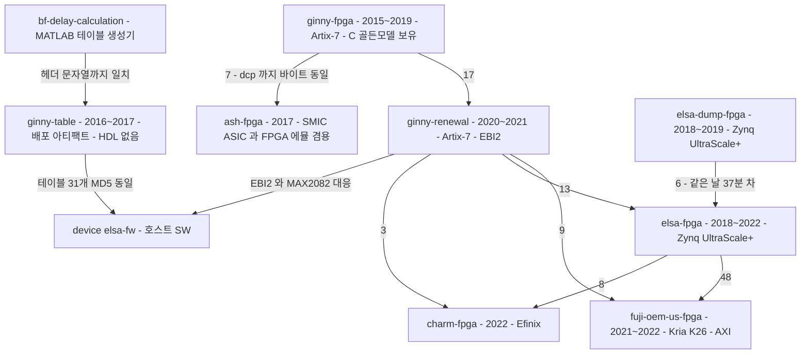

# 기타 그룹 — web · server · fpga

> **근거**: 미러 6건 **코드 직접 읽기** + 파일 해시 대조(2026-07-27).
> **표기**: 해시·바이트 크기·인용 경로는 실측. 해석은 "추정"으로 구분한다.
> device 그룹은 [device-firmware.md](device-firmware.md), mobile 은 [mobile-codebase.md](mobile-codebase.md).

## 1. 한눈에

| 저장소 | 실체 | 규모 | 최종 | 판정 |
|---|---|---|---|---|
| `web/legacy/sonex-admin-web` | 정적 HTML 관리자 콘솔 (빌드 도구 없음) | 12페이지, API 약 50개 | 2023-01 (1커밋) | 실 운영 산출물 |
| `server/legacy/russia-server` | Flask 1파일 | **39줄** | 2023-03 | 프로토타입 |
| `server/legacy/dicomcontroller` | **DICOM SCU 라이브러리 + iOS 샘플** | 1,522 LOC (라이브러리) | 2017-12 | 제품에 편입된 참조 구현 |
| `fpga/legacy/fuji-oem-us-fpga` | Verilog RTL — Zynq UltraScale+ | 106파일 44,240 LOC | 2022-01 | **ginny 의 포크** |
| `fpga/legacy/ginny-renewal` | Verilog RTL — Artix-7 | 101파일 34,707 LOC | 2021-01 | 현행 계보의 본체 |
| `fpga/legacy/ginny-table` | **HDL 0줄** — 배포 아티팩트 저장소 | `.dat` 101 + 비트스트림 27 | 2017-04 | 데이터 저장소 |

**이름과 실체가 다른 것이 3건**이다 — `sonex-admin-web`(실제 제목은 Sonon Cloud Admin) · `dicomcontroller`(서버 아님) · `ginny-table`(FPGA 프로젝트 아님).

## 2. `web/legacy/sonex-admin-web`

빌드 도구가 **전혀 없다** — `package.json`·번들러·CI 부재. Keenthemes 계열 관리자 테마를 통째로 커밋한 정적 사이트이고, 벤더 JS/CSS 가 대부분이다(자체 코드는 HTML 2,530줄 + 수작성 JS 소량, `web-api.js` 622줄).

- **백엔드 호스트가 하드코딩돼 있다** — `assets/js/common/web-api.js:6`: `var SERVER_URL = "http://sonex.healcerion.com:8080/Admin/";` (**평문 HTTP**)
- 화면 12개: 로그인 · 대시보드 · 관리자 계정 · 클라우드(최종사용자) 계정 · 디바이스 · **배터리** · 로그 · 내정보 + 디버그용 `test.html`
- 인증: 비밀번호를 **클라이언트에서 `CryptoJS.SHA256`** 해싱 후 전송, 서버가 준 `connect_token` 을 `sessionStorage`/`localStorage` 에 보관해 매 호출에 파라미터로 첨부
- 권한 모델이 아직 서버 기반이 아니다 — `ROLE_ADMIN_MASTER`·`ROLE_ADMIN_EDITOR`·`ROLE_ADMIN_VIEWER` 와 OEM 목록(`HEAL`·`CERI`)이 `login.js` 에 하드코딩 + `// TODO: apply server API` 주석
- 단일 커밋 메시지가 `"Version 2.11.B - 정식 런칭 버전"` 이다. **개발 이력이 이 저장소에 없다.**

`sonex` 라는 이름과 달리 모든 페이지 `<title>` 이 **`Sonon Cloud Admin`** 이다. 상대인 클라우드 서버(`sonon-cloud`)는 **미확보(B1)** 라 API 명세를 이 프론트엔드에서 역산하는 것 외엔 방법이 없다.

## 3. `server/` — 서버 코드가 없다

### 3.1 `russia-server` — 39줄 프로토타입

Flask 개발 서버 1파일. 엔드포인트 2개뿐이다.

| 메서드·경로 | 동작 |
|---|---|
| `POST /api/v1/saveUSMaterials` | JSON 을 **`print()` 만 하고** uuid4 를 반환. 저장하지 않는다 |
| `POST /api/v1/saveUSImage?id=&pointNum=&mimeType=` | 요청 본문 바이트를 `UPLOAD_FOLDER/<id>_<pointNum>.<mimeType>` 로 기록 |

`UPLOAD_FOLDER = 'd:\\release\\ruski_test'` — 개발자 머신 경로. 인증·검증·에러 처리 전무. 커밋 메시지가 스스로 `"Simple REST API test server for Russia ambulance project"` 라고 밝힌다.

### 3.2 `dicomcontroller` — 서버가 아니라 DICOM 클라이언트 라이브러리

DCMTK 기반 C++ 라이브러리 4클래스(1,522 LOC) + iOS 데모 앱(`iOS_Sample/DCMTK4iOS`).

구현된 DICOM 서비스: **C-STORE**(`DcmStorageSCU::sendSOPInstances`) · **C-ECHO** · **모달리티 워크리스트 C-FIND**(`UID_FINDModalityWorklistInformationModel`). **SCP(수신) 코드는 없다** — 항상 `NET_REQUESTOR` 로만 연결한다. 즉 PACS 에 **보내는 쪽**이다.

제품 결합이 명확하다:
- `DicomController.h`: `HEALCERION_UID_ROOT "1.3.6.1.4.1.45207"` (등록된 DICOM UID root), `SONON300C_UID_ROOT`
- `DicomDataAdapter.cpp:20`: `#define kModelName "SONON 300C"`
- `DicomNetworkController.cpp:20`: `#define kApplicationAETitle "SONON300C"`

다만 데모 코드의 접속 정보가 로컬 LAN 하드코딩(`192.168.0.143`, AE title `testSCU`·`OMMWKLST`)이고, JPEG 압축 경로는 주석 처리된 채 남아 있다. 커밋 14개가 다중 프레임·JPEG·메모리 최적화·태그 추가로 이어지는 실제 개선 이력이다.

> **DICOM 기능의 현재 위치는 여기가 아니다.** `sonex-framework` 가 `DicomHandler` 모듈(2,732 LOC)과 DCMTK 3.6.5 를 따로 갖는다. 이 저장소는 **2017년 세대의 선행 구현**이고, 두 구현 사이에 코드 공유 증거는 확인하지 않았다(미확인).

### 3.3 `sonex-cloud-backend` — admin-web 의 서버가 이것이다

> **초판 정정**: 초판은 "`server/` 에 실 서버가 하나도 없다" 고 결론지었다. **틀렸다.** 당시 이 저장소는 권한 차단 상태였고, 나는 **접근 불가를 부재로 오독**했다.

`sonex-admin-web` 이 호출하는 **48개 엔드포인트 중 47개가 정확히 일치**한다(미매칭 1건 `DeleteAccount` 는 서버에 라우트가 없는 죽은 클라이언트 코드).

| 항목 | 실측 |
|---|---|
| 스택 | Java 8 · Spring MVC 5.2.22 · Spring Security 5.3.13 · MyBatis 3.5.10 · **MariaDB** |
| 패키징 | WAR `finalName=CloudService`. Core(부모, `packaging=war`) + SSO·SDI·ELA 3모듈이 JAR 로 번들 |
| 왜 평면 URL 인가 | `Servlet.xml` 이 `<context:component-scan base-package="Controller"/>` — 모듈별 하위 패키지가 없어 컨트롤러가 **하나의 DispatcherServlet** 에 모인다. admin-web 의 단일 `SERVER_URL = ".../Admin/"` 설계와 정확히 대응 |
| 핸들러 | **124개** (Admin 88 + 모바일용 32 + Core 4) |
| 포트 | `<Server Port="8080"/>` — admin-web 기대치와 일치 |
| 인증 | `connect_token`(16자)이 테이블 `sso.connect_info` 의 **PK**. `CustomAuthenticationFilter.java` 가 검증 |
| 권한 | `Model/RoleModel.java` 가 `ROLE_ADMIN_MASTER`·`ROLE_ADMIN_EDITOR`·`ROLE_ADMIN_VIEWER` 구현 |

> **§2 의 "권한 모델이 서버 기반이 아니다" 도 정정한다.** admin-web 의 `// TODO: apply server API` 주석은 **낡은 것**이고, 서버측 구현은 존재한다. 클라이언트만 보고 서버 부재를 추론한 것이 오류였다.

장비와도 연결된다 — `SDI_Mapper.xml` 이 `probe_id`·`wifi_ssid`·`mac`·`ctrl_port`·`data_port`·`firmware_version`·`cv_license` 필드를 다루고, Postman 컬렉션의 샘플에 `"wifi_ssid": "SONON500L-H-2202050PP"` 가 있다.

`SSO_Procedure.java:915` 주석이 클라이언트 세대를 직접 열거한다 — `접속타입 (1:Moana mobile app, 10:SoNex mobile app, 100:SonNex cloud web service)`. `MigrationUser` 엔드포인트도 있어 **Moana → SoNex 전환이 계정 마이그레이션 수준까지 설계**돼 있었음이 확인된다.

**활동은 희박하다** — 커밋 16개가 2022-09(초기 구축, `"Version 2.11.B - 정식 런칭 버전"` 포함)와 **2025-05-09**(인증메일 디자인 변경·SMTP 앱 패스워드 전환) 두 시점에만 몰려 있다. 테스트·CI 0건, `sdi`·`ela` 스키마 DDL 부재.

### 3.4 `sonon-cloud` — 별개 제품이고 현재 운영 중

Firebase Cloud Functions(Node 10) + Firestore + Vue2(admin) / Quasar(user) SPA. HTTPS 함수 17개(`signUp`·`signIn`·`registerDevice`·`stolenDevices`·`uploadLog` …).

**`sonex-admin-web` 의 엔드포인트와 0/11 일치**한다. 이름 규칙조차 다르고(`signIn` vs `LogIn`), 디바이스 모델은 Firestore 의 범용 `devices` 컬렉션이라 프로브 모델·배터리 도메인이 아예 없다.

| | 값 |
|---|---|
| 커밋 | **394** (2019-03-20 ~ **2026-06-02**) |
| 저자 | **8명** (sungyong 281 · Claud 52 · elvin 31 · Jackie 19 …) |
| 호스팅 | Firebase 3타깃 — 마케팅 사이트 + user-dashboard + admin-dashboard |
| 호스트 | `sonon.healcerion.com` (sonex 의 `sonex.healcerion.com:8080` 과 다름) |
| 브랜드 | `sononx`·`sononvet`·`sphera`·`obvius`·`sonon` 5개 마이크로사이트 (74M 정적 자산) |

**이 워크스페이스에서 실제 테스트를 갖춘 몇 안 되는 저장소다** — `functions/test/*.test.js` Mocha 24개 + Cypress e2e. `documents/Finish-Report.md`(개발 완료 보고서)와 운영 매뉴얼도 있다.

### 3.5 `server/` 컨테이너의 결론 (개정)

**실 서버가 둘 있다.** 하나는 완성 후 버려졌고(`sonex-cloud-backend`, 2022), 하나는 현재 운영 중이다(`sonon-cloud`, 2026-06 까지 커밋). 둘은 공통 파일이 `.gitignore` 하나뿐으로 **계승 관계가 아니라 병렬 제품**이다 — B2B/OEM 장비 관리(Java/MariaDB) vs 소비자·수의용 앱 백엔드(Firebase).

> **⚠ 두 저장소 모두 비밀정보가 커밋돼 있다** — 상세 = [legacy-gaps.md §10](legacy-gaps.md).

## 4. `fpga/` — 세 저장소의 실제 계보

> **초판 정정**: 초판은 계보의 두 조상(`fpga_ginny`·`ELSA FPGA`)을 "미확보" 로 적었다. **둘 다 실재한다** — 각각 `ginny-fpga`(id 18)·`elsa-fpga`(id 56)이고 권한 확대로 확보했다. 아래는 MD5 동일 파일 수를 붙인 개정판이다(간선 위 숫자 = 바이트 동일한 `.v` 파일 개수).



**계보를 확정하는 세 가지 시간 증거**

| 주장(커밋 메시지) | 대조 사실 |
|---|---|
| `elsa-fpga` 최초 커밋: "ELSA DUMP project 코드(2018.12.10)를 기본으로" | `elsa-dump-fpga` 에 **2018-12-10 13:45:48** 커밋 존재 — `elsa-fpga` 최초 커밋(14:22:25)보다 **37분 앞선다** |
| `ginny-renewal` 최초 커밋: "fpga_ginny **2019/7/30** 버전에서 git init" | `ginny-fpga` 의 **최종 커밋이 2019-07-30** |
| `fuji` 2번째 커밋: "ELSA FPGA **21/8/10**일 버전을 초기 버전으로" | `elsa-fpga` 에 **2021-08-10 15:33:52** 커밋 존재 |

**`ash-fpga` 는 FPGA 프로젝트가 아니다** — SMIC 0.13µm **ASIC 프로젝트 + FPGA 에뮬레이션** 겸용이다. `syn/dc_syn`(Synopsys Design Compiler)·`syn/pt_syn`(PrimeTime)·`rtl/SMIC/*.v`(표준셀 모델)·`rtl/memory/*.lib`(메모리 컴파일러 산출물)을 갖고, 탑 모듈이 `ash_asic_top.v` 와 `ash_fpga_top.v` 둘이다. 그리고 **Ginny RTL 에서 파생**됐다 — `ginny-fpga` 의 브랜치 `pw_doppler`·`300L_310C` 에 **`ash_top.v`·`ash_pin.xdc` 가 실수로 커밋돼 있다**(2017-09-13).

**`charm-fpga` 만 Xilinx 가 아니다** — `syn/efx/charm.peri.xml`·`rtl/efinix/*.v`(`Copyright (C) 2013-2018 Efinix Inc.`)로 **Efinix** 를 타깃한다. 이 계열에서 유일한 벤더 이탈이다.

### 4.1 `fuji-oem-us-fpga` 는 `ginny-renewal` 의 포크다 — 식별자급 증거

두 저장소에 **이름이 같은 `.v` 파일 33개** 중 **9개가 MD5 완전 동일**하다: `dcr_adder.v` · `dpbrom720x16.v` · `env_d.v` · `gain.v` · `gain_ctrl.v` · `rf32x12D.v` · `sprom2048x14.v` · `sprom_256x14_gain.v` · `square.v`.

결정적인 것은 fuji 안의 Xilinx 자동생성 IP 헤더가 **ginny-renewal 의 작업 디렉토리 경로를 그대로 담고 있다**는 점이다.

```
// fpga/legacy/fuji-oem-us-fpga/rtl/xilinx_core/sprom2048x14.v
// Command : write_verilog -force -mode funcsim
//           /home/peter/work/project/ginny/fpga_ginny_rn/syn/ip/sprom2048x14/sprom2048x14_sim_netlist.v
// Device      : xc7a100tcsg324-1
```

`fpga_ginny_rn` 은 ginny-renewal 의 작업 디렉토리명이고(`gny_rn.xpr` 의 `Path="/home/dave/work/project/ginny/fpga_ginny_rn/..."`), `xc7a100tcsg324-1` 은 ginny-renewal 의 부품번호다. **ginny 프로젝트 트리 안에서 생성된 파일이 fuji 로 복사됐다.**

나머지 24개는 수십~수백 줄 차이이고, 차이가 큰 것은 정확히 **인터페이스 계층**(`adc_if_top.v`·`interp_bf_top.v`·`regfile.v`·`top.v`·`irq_ctrl.v`)이다 — 하드웨어 생태계가 바뀐 부분이다.

| | `ginny-renewal` | `fuji-oem-us-fpga` |
|---|---|---|
| 부품 | **Artix-7** `xc7a100tcsg324-1` | **Zynq UltraScale+** `xck26-sfvc784-2LV-c` (Kria K26 SOM) |
| 툴 | Vivado **2020.1.1** | Vivado **2021.1** |
| 호스트 I/F | **EBI2 병렬 버스** (`rtl/cpu_if/cpu_if.v`, 14비트 주소 / 16비트 데이터) | **AXI-Lite** (`rtl/zynq_if/axi_lite.v` — Red Pitaya 유래) |
| AFE·펄서 | MAX2082 AFE / MAX4968 펄서 | TI AFE5816/5832 ADC / **TI TX7332** 펄서 |

RX 신호 체인의 모듈 taxonomy 는 양쪽이 동일하다 — DC 제거(`dcr64T.v`) → 직교 복조(`dqd`/`mix`) → 데시메이션 FIR(`ds`/`pdf`/`pmac`) → 디지털 TGC(`dtgc`) → 게인 → **RX 빔포머**(`interp_bf`, 지연 테이블 메모리) → 포락선 검출(`env_d`/`sqrt`/`square`) → B/M/CF/PW 스캔 버퍼.

### 4.2 `ginny-table` 은 FPGA 프로젝트가 아니다

전 이력(`git log --all --name-only`)을 통틀어 커밋된 확장자가 **`.dat`·`.bin`·`.conf` 셋뿐**이다. HDL·TCL·제약파일·생성 스크립트가 **한 번도 존재한 적이 없다.**

내용은 제품 모델별(`300c`·`300c_hermione`·`300l`·`300mc`·`310c`) 배포 번들이다 — 비트스트림 + `system.conf` + 룩업 테이블(`tx_delay*.dat`·`rx_delay*.dat`·`atgc*.dat`·`sequence_b/c.dat`·`prf_depth.dat`·`max2082_reg.dat` …). 형식은 **ASCII 텍스트**이고, RTL 내부용 `.coe`/`.mif` 와는 별개인 **호스트 배포 형식**이다.

**생성기는 이 저장소에 없지만, 별도 저장소로 실재한다.** — `fpga/legacy/bf-delay-calculation`(§4.5). 커밋 `7bf5b91 "[Linear] Tx Focus 변경에 따른 Tx delay table generation"` 의 diff 가 `.dat` 뿐이고 스크립트가 동반되지 않는 것은, 생성기가 다른 저장소에 있기 때문이다.

121MB 의 정체는 **비트스트림 27개**다(각 3,825,788 바이트).

### 4.3 검증 체계는 이 워크스페이스에서 가장 낫다

`ginny-renewal`·`fuji` 는 동일한 방법론을 쓴다 — Cadence Xcelium(`xrun`) + `gd_*.v` 골든 모델 비교 모듈 + `.f` 파일리스트. `ginny-renewal` 은 여기에 더해 **비트정확 C 골든 모델**(`model/src/rx_bf.c`·`rx_dcr.c`·`rx_dqd.c`·`rx_ds_linear.c`·`rx_log.c`, 1,265 LOC)과 `run_linear`·`run_tp` 스크립트로 스테이지별 기대 벡터(`bench/vector/`)를 생성·대조한다. `tb_tbl_init.v` 는 실제 `.dat` 테이블을 버스 BFM 으로 써 넣어 검증한다.

> **device·mobile 그룹에는 이런 장치가 없다.** 리팩토링 시 참고할 사내 선례가 FPGA 팀에 있다.

### 4.4 저장소 위생

`ginny-renewal` 119MB 는 **커밋된 비트스트림 8개(각 3,825,788B) + `.zip` 7개 + 폐기 IP 산출물 57파일(`rtl/xilinx_core/old/`)** 때문이다. 반면 `fuji` 는 5.6MB 로 **바이너리 산출물이 하나도 없다** — `.gitignore` 가 Vivado 산출물을 제외한다. **같은 팀이 나중 프로젝트에서 위생을 개선했다.**

### 4.5 `bf-delay-calculation` — 없다고 단정했던 테이블 생성기

MATLAB `.m` 9개(3,368 LOC). 커밋 2개(2017-04-20 james · 2018-03-08 peter "james 마지막 작업 폴더 동기화 를 위해 올림").

**출력이 `ginny-table` 의 실제 파일과 헤더 문자열까지 일치한다.**

생성기 코드(`Ginny_Universal_Tx_Delay_Table_Linear_Convex_Final.m:264-296`):
```matlab
fprintf(fid, '## TX delay table : %s \n', model_name);
fprintf(fid, '## Author : Daniel \n');
fprintf(fid, '## Date : 2016-12-15 New Tx focus delay center Align \n');
... fprintf(fid,'%03d ', delay_index_cnt); fprintf(fid,'%03d ', depth_cnt);
```
실제 산출물(`ginny-table/300l/tx_delay_c00.dat`):
```
## TX delay table : c00 
## Author : Daniel 
## Date : 2016-12-15 New Tx focus delay center Align 
001 005 100 119 137 154 169 183 195 205 213 219 223 225 225 223 219 213 205 195 183 169 154 137 119 100 
```

헤더·저자명·날짜 문자열·`%03d` 배치가 전부 같다. 유사가 아니라 **동일**이다.

모델별 변종도 대응한다 — `Tx_Delay_Convex_300c_Final.m` 은 헤더 없이 `%03d %03d` 만 쓰는데, `ginny-table/300c/tx_delay.dat`·`300c_hermione/tx_delay.dat` 가 정확히 그 형식(헤더 0줄)이고 `310c/tx_delay.dat` 는 헤더 있는 형식이다.

Xilinx `.coe` BRAM init 도 생성한다(`ash_total_Rx_delay_table_James_20170615.m:581-630` — `memory_initialization_radix = 10;` 헤더). 다만 이쪽 산출물(`pa_sin_theta.coe`·`vc_ele_rad.coe` 등)은 **Ash 의 phased-array·virtual-convex 용**이고 Ginny 의 BRAM 초기화와는 다른 계통이다.

지원 형상: Linear(pitch 0.3mm) · Convex(0.48mm, RoC 60mm) · Micro-convex(300MC) · **Phased-array**(RoC 70mm) · **Virtual-convex**(RoC 15mm) · "Mirae" 16Rx/32Tx 변종.

> **초판이 이것을 놓친 이유**: `ash_total_Rx_delay_table_James_20170615.m` 가 **ISO-8859 인코딩**이라 `grep -a` 없이는 매칭되지 않는다. 도구 한계를 "부재" 로 결론지은 사례다.

## 5. `fpga/` 와 `device/` 는 실제로 물려 있다 — 신규 확인

CLAUDE.md 는 `fpga/` 를 "cctv 대응 없는 healcerion 고유 축" 으로 두었다. **코드상으로는 device 그룹과 강하게 결합돼 있다.**

### 5.1 명시적 참조 + 해시 증거

가장 직접적인 증거는 `elsa-fw` 의 개발자 스크립트다 — `device/legacy/elsa-fw/scripts/sync_table.sh` 가 **`ginny-table` 저장소를 이름으로 지목**하고 두 트리를 `meld` 로 대조한다.

```sh
FW=~/__WORK/S300L/ginny-fw/configs/
TABLE=~/__WORK/S300L/ginny-table/
```

(`elsa-fw` 의 내부 옛 이름이 `ginny-fw` 임도 여기서 드러난다.)

`device/legacy/elsa-fw/configs/300l` 과 `fpga/legacy/ginny-table/300l` 의 동명 파일 35개 중 **31개가 MD5 완전 동일**하다. 다른 4개는 `fpga.bin`(심볼릭 링크 대상이 다름) · `fpga_reg.dat` · `sequence_c.dat` · `system.conf` 뿐이다.

동일한 것에는 **비트스트림 `ginny_0308_apd_bit.bin`(3,825,788B)** 과 `max2082_reg.dat`·`rx_delay_*.dat`·`tx_delay_*.dat`·`atgc_*.dat` 가 포함된다. 즉 **elsa-fw 가 ginny 세대의 FPGA 비트스트림과 빔포밍 테이블을 그대로 싣고 있다.**

### 5.2 비트스트림이 전부 같은 부품이다 — IDCODE 로 확정

세 저장소의 비트스트림 **43개 전량이 정확히 3,825,788 바이트**이고(ginny-table 27 · ginny-renewal 8 · elsa-fw 8), 오프셋 `0x30` 의 Xilinx sync word 가 `aa99 5566` 이다.

크기·해시는 정황이므로 **비트스트림의 IDCODE 를 직접 파싱**했다(sync word 이후 IDCODE 레지스터 write 패킷 `0x30018001` 의 다음 워드).

| 파일 | IDCODE |
|---|---|
| `device/legacy/elsa-fw/configs/500l/top_steer_1211.bin` | **`0x03631093`** |
| `device/legacy/elsa-fw/configs/300l/ginny_0308_apd_bit.bin` | **`0x03631093`** |
| `fpga/legacy/ginny-table/300c/fpga.bin` | **`0x03631093`** |
| `fpga/legacy/ginny-renewal/syn/bit_file/300L_200623_img_st.bin` | **`0x03631093`** |

`0x03631093` = **XC7A100T**. `ginny-renewal` 의 `.xpr` 이 선언한 `xc7a100tcsg324-1` 과 일치하고, **`elsa-fw` 가 싣는 비트스트림도 동일 부품**임이 확정된다(추정이 아니라 식별자 일치).

### 5.2.1 남는 모순 — 호스트는 ZynqMP 인데 비트스트림은 Artix-7

`elsa-fw` 의 호스트 SoC 는 ZynqMP 다(§[device-firmware.md §3](device-firmware.md)). 그런데 `scripts/fpga_dnw.sh` 는 `/userdata/fpga.bin` 을 **ZynqMP FPGA manager**(`/sys/class/fpga_manager/fpga0/firmware`)로 로드하고, `scripts/belle-post.sh` 는 `fpgautil -b /userdata/fpga.bin` 을 쓴다.

주목할 점은 **경로가 다르다**는 것이다 — FPGA manager 가 읽는 것은 `/userdata/fpga.bin` 이고, 테이블·Artix 비트스트림이 놓이는 곳은 `/userdata/config/500l/` 이다. FPGA 가 둘(ZynqMP PL + 외부 Artix-7)인지, `configs/` 의 Artix 비트스트림이 ginny 세대 잔존물인지 **미러만으로는 확정할 수 없다.**

### 5.3 버스와 AFE 도 일치한다

| `device/legacy/elsa-fw` | `fpga/legacy/ginny-renewal` |
|---|---|
| `lib/fpga_ebi.cpp` · `fpga_ebi_*.cpp`, `EBI_BASE_PHY` | `rtl/cpu_if/cpu_if.v` — **EBI2 병렬 버스**, `bench/ebi2_fpga_io.v` BFM |
| `lib/fpga_ebi_max2082.cpp` (MAX2082 아날로그 빔포머 mux) | **MAX2082 AFE** 전제 설계, `max2082_reg.dat` |

호스트 SW 쪽 버스 드라이버와 RTL 쪽 버스 인터페이스가 대응한다.

### 5.4 읽는 방식 (추정)

`elsa-fw` 는 **Zynq UltraScale+ MPSoC 에서 Linux 로 도는 호스트 SW** 이고, **초음파 프론트엔드는 별도의 Artix-7(ginny 계보) FPGA** 이며 EBI 버스로 연결된다. `configs/300l` 은 ginny 세대에서 이어받은 자산이고, 현행 타깃은 `configs/500l` 이다 — 이쪽에만 `SA_*`(Synthetic Aperture) 테이블 세트가 있고 루트 CMake 의 빌드 플래그가 `-D_USING_500L_DEV_`·`-D_USING_SA_DEV_` 다.

`configs/300l` 이 ginny 세대 자산이라는 것은 코드가 뒷받침한다 — `elsa-fw` 안에서 300 시리즈 경로는 `/usr/share/ginny/300l/`, 500 시리즈는 `/usr/share/belle/500l/` 이고 `lib/fpga_define.h` 가 `_USING_500L_DEV_` 매크로로 가른다. 루트 CMake 가 그 매크로를 정의하므로 현행은 belle 이다. 상세 = [device-firmware.md §3.1·§7](device-firmware.md).

**남은 미확정은 §5.2.1** — 두 FPGA 인지 잔존물인지다.

## 6. HLAB-2487 함의

| 관측 | 함의 |
|---|---|
| `fuji` 가 `ginny` 의 포크이고 두 저장소가 **9파일 바이트 동일** | 이미 **복제-분기 방식의 재사용**이 일어나 있다. 공통 IP 를 라이브러리화하는 것이 FPGA 축의 명확한 리팩토링 대상이다 |
| `fpga/` 가 `device/` 와 테이블·비트스트림·버스로 결합 | **독립 축이 아니다.** cctv 대응이 없다는 이유로 분리해 두면 실제 결합을 놓친다. 배포 아티팩트(비트스트림+테이블)의 소유 위치를 정하는 것이 축 설계의 핵심 |
| 같은 테이블이 `ginny-table` 과 `elsa-fw/configs` 에 **중복 사본**으로 존재 | 단일 출처가 없다. 어느 쪽이 정본인지 코드로 알 수 없다 |
| 테이블 **생성기가 어디에도 없다** | 프로브 스펙이 바뀌면 테이블을 다시 만들 수단이 저장소에 없다. `ginny-renewal/model/` 의 C 모델이 유일한 단서 |
| `server/` 에 실 서버가 없다 | 축 매핑에서 빈 칸. `sonon-cloud` 확보(B1)가 선행 조건 |
| `sonex-admin-web` 이 평문 HTTP + 클라이언트측 권한 스텁 | 클라우드 축 리팩토링 시 보안 재설계가 포함돼야 한다 |
| FPGA 팀만 골든 모델·회귀 벡터 체계를 갖는다 | 사내에 참고 가능한 검증 선례가 있다 |

## 7. 미확인

- `configs/*/fpga.bin` 을 로드하는 주체 — ZynqMP FPGA manager 경로(`/userdata/fpga.bin`)와 Artix-7 테이블 경로(`/userdata/config/500l/`)가 갈린다(§5.2.1)
- 테이블 생성 도구의 소재 — 세 FPGA 저장소 어디에도 없다
- `dicomcontroller`(2017) 와 `sonex-framework/DicomHandler`(현행) 사이의 코드 계승 여부 — 대조하지 않았다
- `sonon-cloud` 미확보(B1) 로 인해 `sonex-admin-web` 이 호출하는 API 약 50개의 서버측 구현을 확인할 수 없다
- `ginny-table` 의 선행 프로젝트 `fpga_ginny`(2019-07-30 스냅샷) 와 `ELSA FPGA`(2021-08-10 스냅샷) 는 **미러에 없다**. 두 포크 지점의 원본이 모두 부재하다
